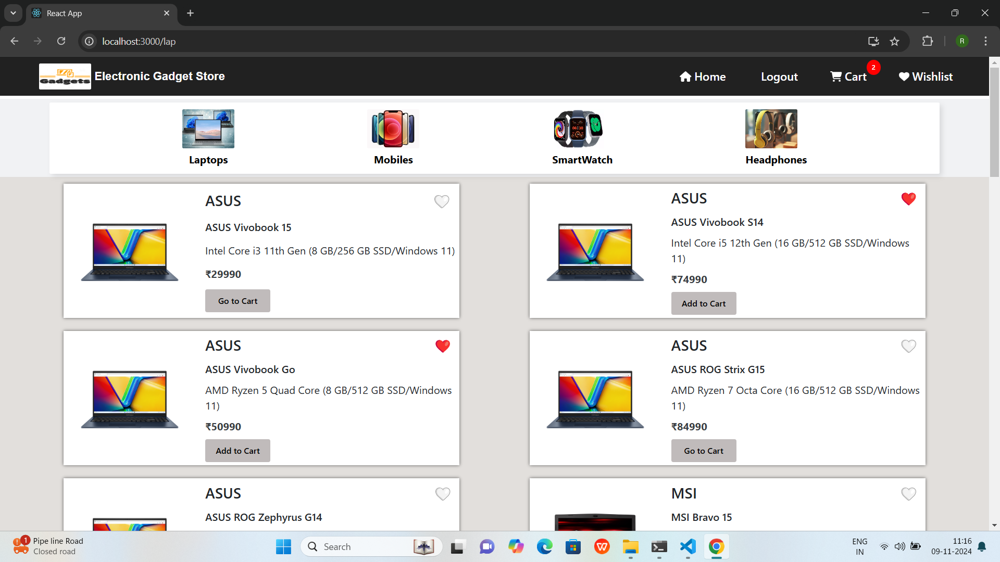

# E-Commerce Application (Frontend Only)

An e-commerce application built with React, featuring separate user and admin modules. Users can explore products, manage their cart and wishlist, and proceed through a simulated checkout. Admins have control over product and user management, with options to ban users and prevent them from logging in.

## Table of Contents

- [Features](#features)
- [Demo](#demo)
- [Installation](#installation)
- [Usage](#usage)
- [Technologies Used](#technologies-used)
- [Contributing](#contributing)
- [License](#license)

---

## Features

### User Module
- **Product Browsing**: View products by categories.
- **Cart and Wishlist Management**: Add items to the cart or wishlist, view cart items, and proceed to checkout.
- **Profile Management**: Update personal information and view order history.

### Admin Module
- **CRUD Operations**: Create, read, update, and delete products (using local state or demo data).
- **User Management**: View and ban users.
- **User Ban**: Banned users cannot log in or access the application.

---

## Demo

Include some sample screenshots of the application:

- 

---

## Installation

To run this project locally, follow these steps:

### Prerequisites

- Node.js

### Clone the Repository

Clone the project repository and navigate to the project directory:

```bash
git clone https://github.com/your-username/ecommerce-frontend.git
cd ecommerce-frontend
```

# Install Dependencies and Run the application

 ```bash
 npm install
 npm start
```

- The frontend will run on http://localhost:3000.

### Usage

1. Sign Up or Login: Register as a new user or log in.
2. Browse Products: User can View products by category.
3. Manage Cart and Wishlist: Add items to your cart or wishlist and proceed to checkout.
4. Admin Access: Access the admin panel to manage products, users.

### Admin Credentials (for demo purposes)

- Username: admin@example.com
- Password: password (You can hardcode or mock these for demo purposes in your React app)

### Technologies Used

- Frontend: React, Redux, Bootstrap, react-router
- Styling: CSS, Bootstrap
